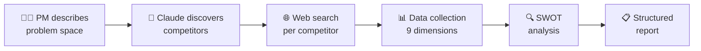

<p align="center">
  
  
  
  
</p>

<h1 align="center">🔬 Claude Skill for Competitive Analysis</h1>

<p align="center">
  <strong>A powerful AI-driven competitive intelligence toolkit for Product Managers</strong><br/>
  <em>Deep, multi-source market research — automated with Claude and real-time web data</em>
</p>

<p align="center">
  <a href="#-features">Features</a> •
  <a href="#-how-it-works">How It Works</a> •
  <a href="#-project-structure">Structure</a> •
  <a href="#-quick-start">Quick Start</a> •
  <a href="#-data-sources">Data Sources</a> •
  <a href="#-output-format">Output</a> •
  <a href="#-contributing">Contributing</a>
</p>

---

## 🎯 What Is This?

This repository contains a **Claude Custom Skill** and a **React-based UI tool** that together enable Product Managers to run deep, automated competitive analysis on any product or problem space.

Instead of spending days manually researching competitors, simply describe the problem your product solves — and Claude will:

1. **Discover** 5–8 real competitors across the web
2. **Research** each one across 9 intelligence dimensions
3. **Generate** a structured SWOT analysis for each
4. **Deliver** a comprehensive, data-backed competitive landscape report

> 💡 **Zero hallucinations by design** — every data point is sourced from live web searches. If data can't be found, it's marked as "Not found / unavailable" rather than fabricated.

---

## ✨ Features

| Feature | Description |
|---|---|
| 🔍 **Auto Competitor Discovery** | Finds competitors via Google, Product Hunt, Y Combinator, Crunchbase & Tracxn |
| 📊 **Website Traffic Analysis** | Monthly visits, traffic trends, top traffic countries |
| 📱 **Mobile App Intelligence** | Play Store & App Store presence, installs, ratings, reviews |
| 💰 **Funding & Financials** | Total raised, funding rounds, investor names, revenue data |
| ⭐ **Review Aggregation** | Google Reviews & Trustpilot ratings and review counts |
| 📣 **Social Media Mapping** | Instagram, X/Twitter, YouTube, LinkedIn presence & follower counts |
| 👥 **Founder Profiling** | Names, education, professional background, LinkedIn URLs |
| 🧑‍💼 **Employee Growth Tracking** | Headcount and hiring trend analysis via LinkedIn |
| 📰 **Press & Media Coverage** | Featured publications, blogs, and recent media mentions |
| 🔍 **SWOT Analysis** | Auto-generated Strengths, Weaknesses, Opportunities & Threats per competitor |

---

## 🏗️ How It Works



### The Pipeline

1. **Problem Discovery** — You describe the core problem your product solves
2. **Competitor Discovery** — Claude searches across 5+ platforms to identify 5–8 real competitors
3. **Deep Research** — For each competitor, Claude runs targeted web searches across 9 data categories
4. **SWOT Generation** — Strengths, Weaknesses, Opportunities & Threats are synthesized from collected data
5. **Report Delivery** — Everything is presented in a structured, actionable format

---

## 📁 Project Structure

```
Claude-Skill-for-Competitive-Analysis/
│
├── 📄 README.md                          # You are here
├── 🧠 competitive-analysis-pm.skill      # Claude Custom Skill (packaged .skill file)
└── ⚛️  competitive-analysis-tool.jsx      # React UI component for interactive analysis
```

### `competitive-analysis-pm.skill`

The **Claude Custom Skill** file — a packaged instruction set that turns Claude into a competitive intelligence analyst. Contains:

- Trigger phrases and activation rules
- Step-by-step research methodology
- Data collection templates for 9 intelligence dimensions
- SWOT analysis framework
- Structured output format specification
- Hallucination prevention rules

> 📦 This is a `.skill` file (ZIP archive) containing a `SKILL.md` markdown definition. Import it directly into Claude's custom skills.

### `competitive-analysis-tool.jsx`

A **React component** that provides a beautiful, dark-themed UI for running competitive analysis interactively. Features:

- Problem input interface with guided prompts
- Real-time progress tracking with animated progress bar
- Expandable competitor cards with full data breakdowns
- Color-coded SWOT analysis grid
- Social media presence chips
- Founder profile cards
- Investor badges

> ⚛️ Built with React (JSX) — uses the Anthropic Messages API with web search tool for live data.

---

## 🚀 Quick Start

### Option 1: Use the Claude Skill (No Code)

1. Open **Claude** (claude.ai or Claude Desktop)
2. Navigate to **Custom Skills** / **Projects**
3. Import `competitive-analysis-pm.skill`
4. Start a conversation and say:
   ```
   Analyze the competitive landscape for [your problem space]
   ```
5. Claude will guide you through the analysis step by step

### Option 2: Use the React UI Component

1. Clone this repository:
   ```bash
   git clone https://github.com/AmanKumarSinhaGitHub/Claude-Skill-for-Competitive-Analysis.git
   ```

2. Import the component into your React project:
   ```jsx
   import CompetitiveAnalysis from './competitive-analysis-tool';
   ```

3. Set up your Anthropic API key (the component calls the Anthropic Messages API)

4. Render the component:
   ```jsx
   <CompetitiveAnalysis />
   ```

> ⚠️ **Note:** The React component requires an Anthropic API key with access to `claude-sonnet-4-20250514` and the `web_search_20250305` tool.

---

## 🌐 Data Sources

The skill searches across multiple platforms to ensure comprehensive coverage:

| Source | What It Provides |
|---|---|
| **Google Search** | General competitor discovery, press coverage, reviews |
| **Product Hunt** | Startup/product discovery in the space |
| **Y Combinator** | YC-backed competitors |
| **Crunchbase** | Funding data, company basics, investors |
| **Tracxn** | Startup tracking and intelligence |
| **SE Ranking** | Website traffic and analytics |
| **SimilarWeb** | Traffic data (fallback source) |
| **Google Play Store** | Android app data — installs, ratings, reviews |
| **Apple App Store** | iOS app data — ratings, reviews |
| **Trustpilot** | Customer review ratings |
| **LinkedIn** | Employee count, growth trends, founder profiles |
| **Instagram / X / YouTube** | Social media presence and follower counts |

---

## 📋 Output Format

The analysis produces a structured report covering each competitor:

```
📊 Company Overview      → Website, HQ, Founded Year, Description
📈 Website Traffic        → Monthly Visits, Trend, Top Country
📱 Mobile Apps            → Android & iOS — Live Status, Installs, Rating, Reviews
💰 Funding & Financials   → Total Raised, Rounds, Investors, Revenue, Losses
⭐ Reviews                → Google & Trustpilot Ratings + Counts
📣 Social Media           → Instagram, X, YouTube, LinkedIn Presence
👥 Founders               → Names, Education, Background, LinkedIn
🧑‍💼 Employee Growth       → Headcount + Hiring Trend
📰 Press Coverage         → Publications & Media Mentions
🔍 SWOT Analysis          → Strengths, Weaknesses, Opportunities, Threats
```

Plus a **Competitive Landscape Summary Table** and **Key Takeaways** for actionable product strategy.

---

## 🛡️ Hallucination Prevention

This tool is built with strict anti-hallucination guardrails:

| Rule | Description |
|---|---|
| **No invented numbers** | Traffic, downloads, funding, followers — if not found, marked as such |
| **Source citation** | Every data point cites its source (e.g., "per Crunchbase") |
| **Conflict resolution** | Conflicting data from multiple sources is noted with both values |
| **Funding verification** | Only reported if confirmed by press release, Crunchbase, or news |
| **Social media accuracy** | Only reported if the official page was directly found |

---

## 🎨 UI Preview

The React component features a **premium dark theme** with:

- 🌑 Deep dark background (`#0a0a0f`) with card surfaces
- 💜 Accent purple (`#6c63ff`) for interactive elements
- 🟡 Gold highlights (`#f5c842`) for key metrics
- 🟢 Green badges (`#4ade80`) for completed items and strengths
- 🔴 Red accents (`#f87171`) for weaknesses and threats
- ✨ Animated progress bars, expandable cards, and hover effects

---

## 🤝 Contributing

Contributions are welcome! Here's how to help:

1. **Fork** this repository
2. **Create** a feature branch (`git checkout -b feature/amazing-feature`)
3. **Commit** your changes (`git commit -m 'Add amazing feature'`)
4. **Push** to the branch (`git push origin feature/amazing-feature`)
5. **Open** a Pull Request

### Ideas for Contribution

- [ ] Add more data sources (G2, Capterra, etc.)
- [ ] Export report as PDF
- [ ] Add competitor comparison matrix view
- [ ] Historical tracking of competitor metrics
- [ ] Integration with Notion/Confluence for report sharing

---

## 📄 License

This project is licensed under the MIT License — see the [LICENSE](LICENSE) file for details.

---

## 👨‍💻 Author

**Aman Kumar Sinha**

- GitHub: [@AmanKumarSinhaGitHub](https://github.com/AmanKumarSinhaGitHub)

---

<p align="center">
  <strong>Built with 🤖 Claude AI + ❤️ for Product Managers</strong><br/>
  <em>Stop guessing about your competition. Start knowing.</em>
</p>
